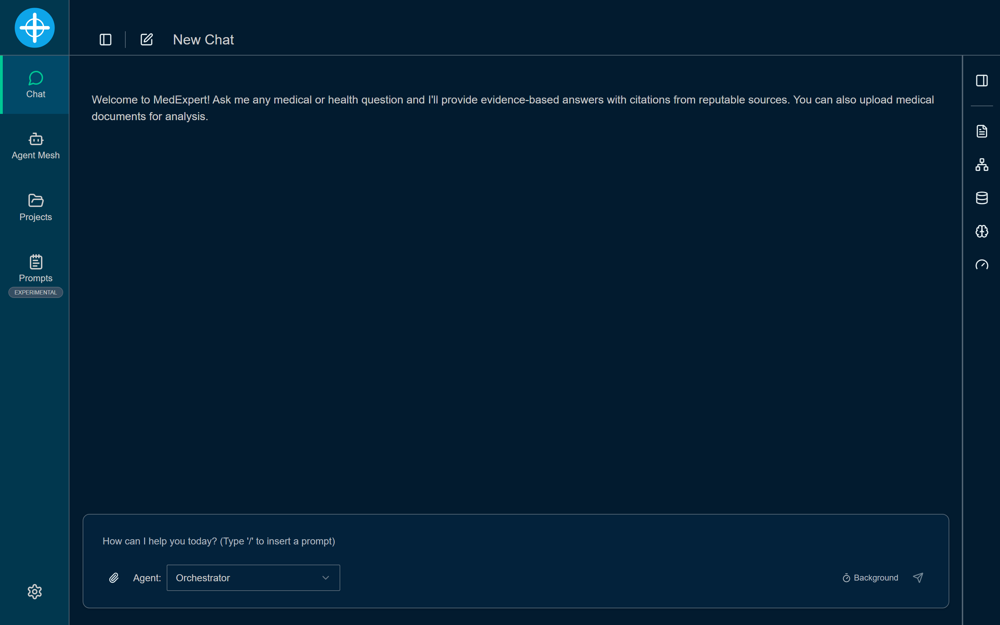
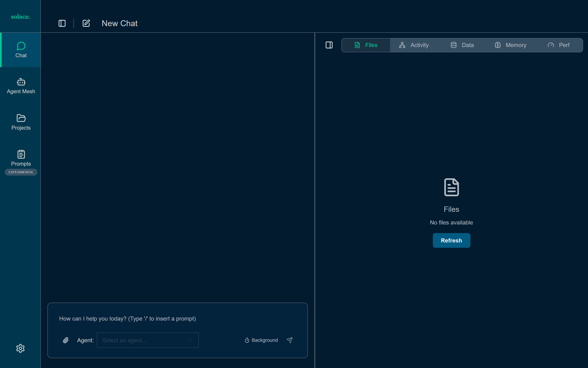
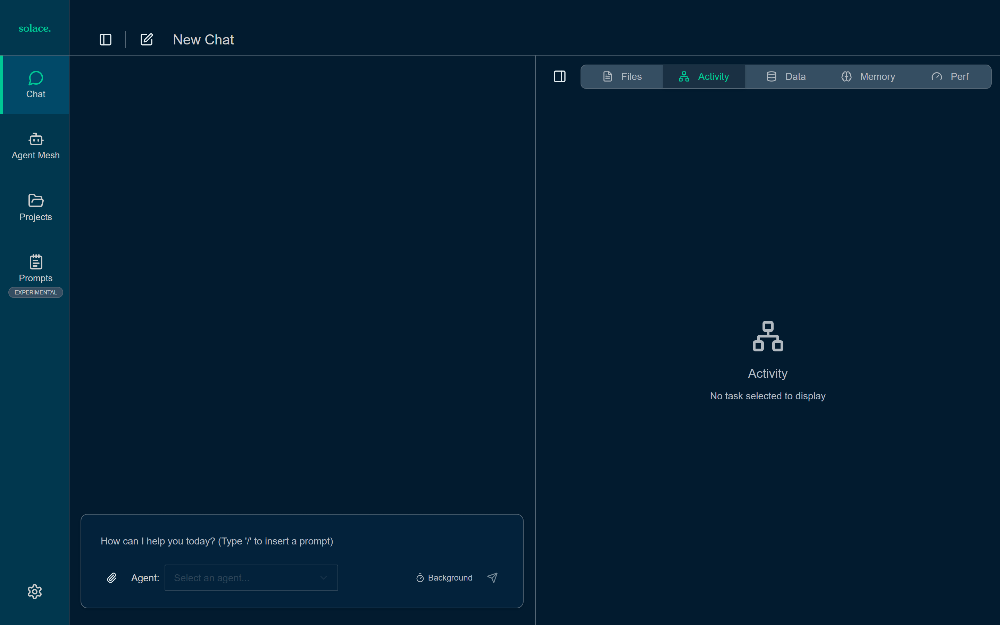
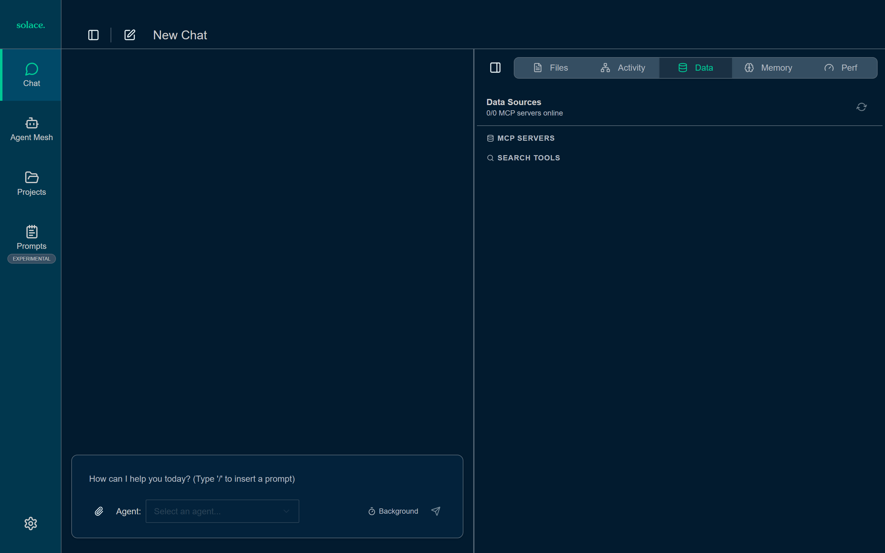
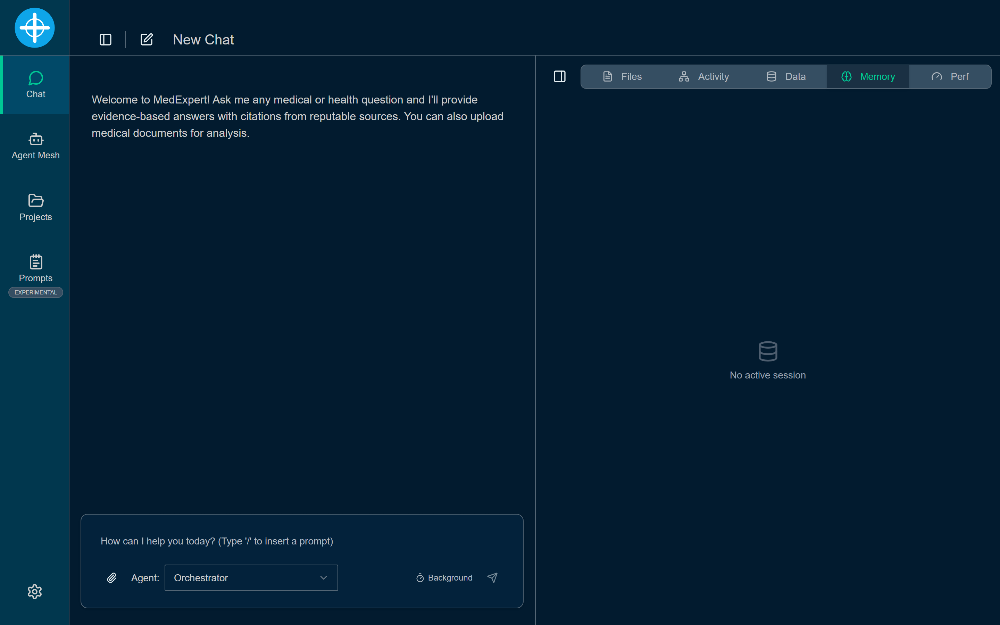
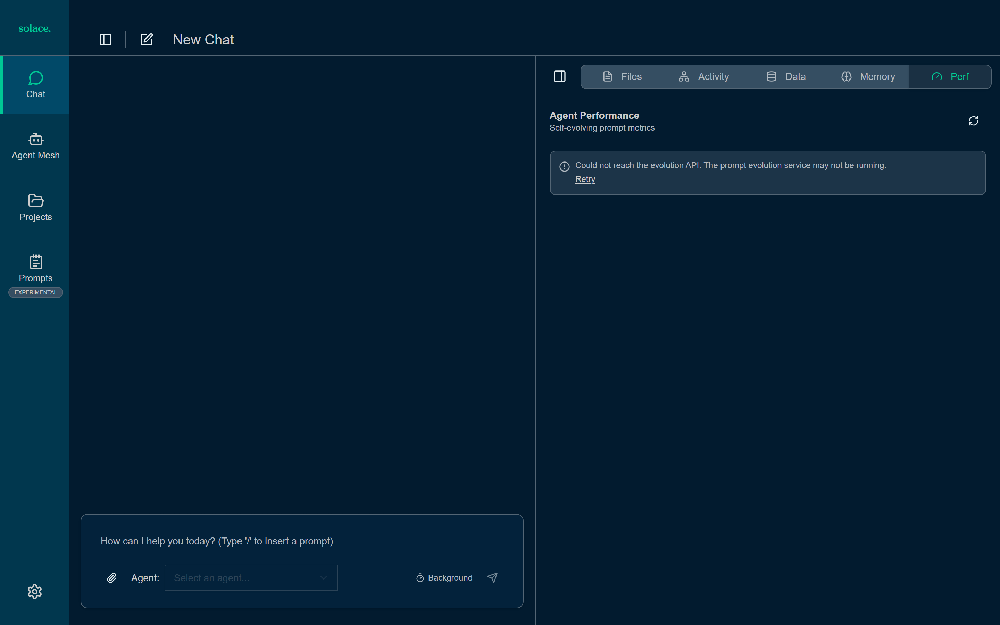
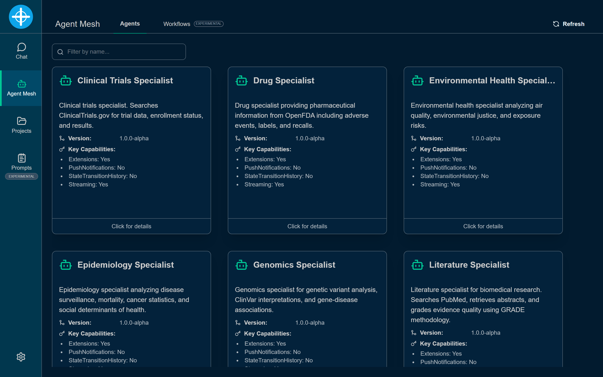
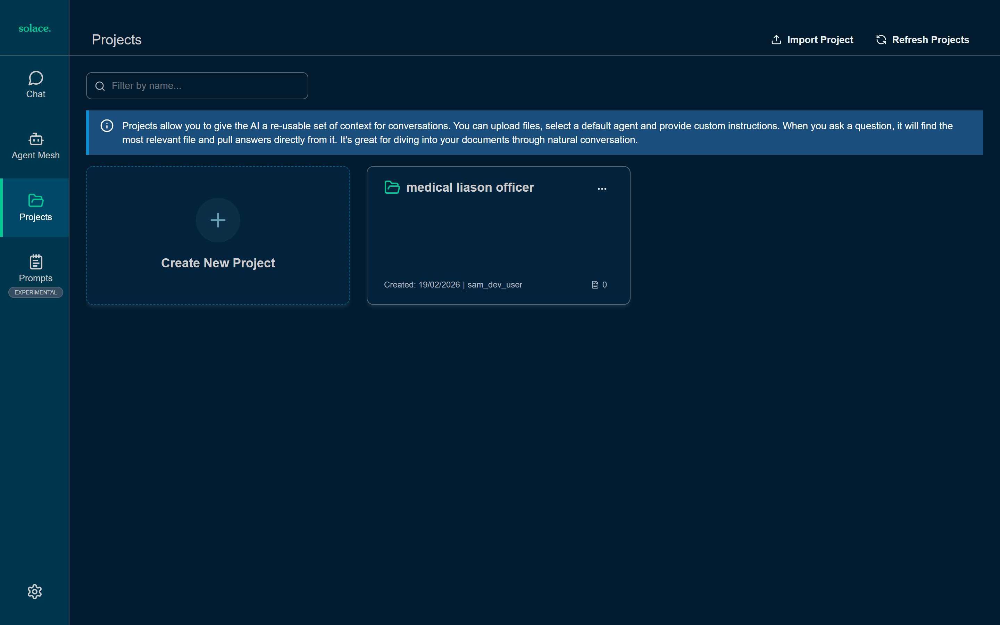
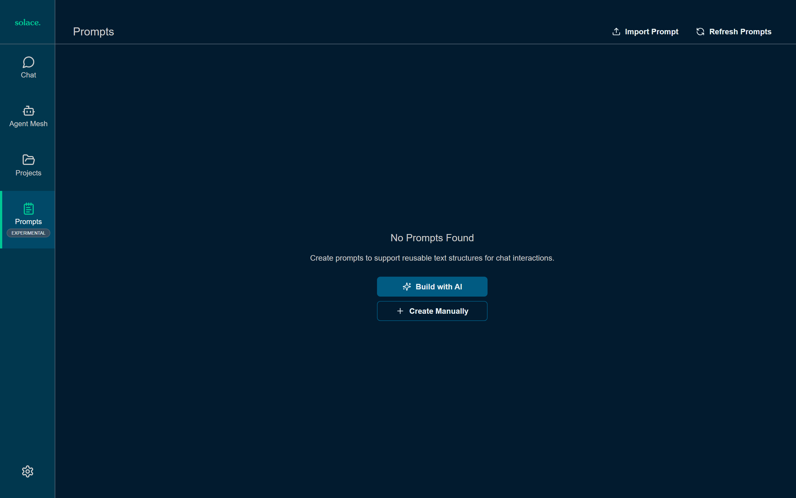
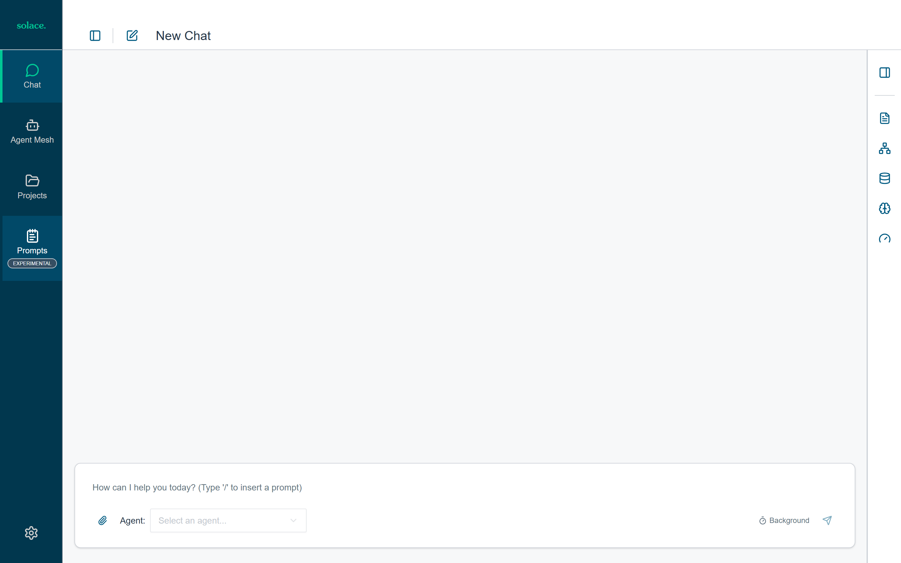

<h1 align="center">MedExpert</h1>
<h3 align="center">Multi-agent deep research platform for life sciences</h3>

<p align="center">
  <a href="#screenshots">Screenshots</a> &middot;
  <a href="#architecture">Architecture</a> &middot;
  <a href="#quick-start">Quick Start</a> &middot;
  <a href="#research-protocol">Research Protocol</a> &middot;
  <a href="#development">Development</a>
</p>

---

MedExpert is a multi-agent AI system that answers complex medical and scientific questions by coordinating 12 specialized agents across a rigorous 12-step research protocol. It searches PubMed, ClinicalTrials.gov, OpenFDA, CDC, genomic databases, and 10+ other biomedical sources, then synthesizes evidence-graded answers with full citations.

Every answer goes through a Generator-Verifier-Reviser (GVR) loop: the orchestrator synthesizes a report, a verifier agent (using a stronger model at low temperature) fact-checks each claim against its cited sources, and a reviser corrects any issues before the answer reaches the user.

Built on the **Solace Agent Mesh (SAM)** framework for event-driven, broker-based agent communication using the A2A protocol.

---

## Screenshots

### Chat Interface

The main chat view with message input, agent selector, and collapsible side panel.

<p align="center">
  
</p>

### Side Panel Tabs

The right-side panel provides five tabs for inspecting research activity in real time.

<table>
  <tr>
    <td align="center"><strong>Files</strong><br/>Uploaded documents and generated artifacts<br/></td>
    <td align="center"><strong>Activity</strong><br/>Agent task workflow and step details<br/></td>
  </tr>
  <tr>
    <td align="center"><strong>Data Sources</strong><br/>MCP server health and search tool status<br/></td>
    <td align="center"><strong>Memory</strong><br/>Session memory plane state<br/></td>
  </tr>
  <tr>
    <td align="center" colspan="2"><strong>Performance</strong><br/>Self-evolving prompt metrics<br/></td>
  </tr>
</table>

### Agent Mesh

View discovered agents and experimental workflow definitions.

<p align="center">
  
</p>

### Projects & Prompts

Manage reusable project contexts and prompt templates.

<table>
  <tr>
    <td align="center"></td>
    <td align="center"></td>
  </tr>
  <tr>
    <td align="center"><strong>Projects</strong></td>
    <td align="center"><strong>Prompts</strong></td>
  </tr>
</table>

### Light Mode

<p align="center">
  
</p>

---

## Architecture

```
User Query
    |
    v
Orchestrator (12-step protocol)
    |
    +---> 8 Specialist Agents (literature, clinical trials, drug,
    |     regulatory, epidemiology, genomics, environmental, provider intel)
    |
    +---> 15 MCP Servers (PubMed, ClinicalTrials.gov, OpenFDA, CDC,
    |     SEER, EPA, ClinVar, Census SDOH, ...)
    |
    +---> MedicalExpert Agent (web search for simple questions)
    |
    v
GVR Loop: Generate --> Verify --> Revise
    |
    v
Evidence-graded report with citations
```

### How the Agents Reason

MedExpert agents don't just call APIs — they implement structured reasoning patterns that mirror how medical researchers think.

**Orchestrator: Protocol-Driven Decomposition**

The orchestrator uses a prescriptive 12-step protocol (not free-form chain-of-thought) to ensure systematic coverage. It decomposes complex questions into domain-routed sub-questions using keyword heuristics, delegates to specialists in priority order, then reflectively identifies gaps before synthesizing. This is closer to a research methodology than a chatbot prompt.

Key reasoning mechanisms:
- **Query decomposition** — Breaks multi-faceted questions into domain-specific sub-questions (e.g., "What are the drug interactions and genomic factors for metformin?" becomes separate queries for DrugSpecialist and GenomicsSpecialist)
- **Reflective gap analysis** — After collecting evidence, explicitly identifies contradictions, missing perspectives, and logical gaps before synthesis
- **Advisory board deliberation** — Generates 6 distinct analytical perspectives (Clinical Pragmatist, Research Methodologist, Patient Advocate, Health Economist, Bioethicist, Global Health Specialist) to prevent single-perspective bias, then synthesizes consensus and dissent
- **Learned routing** — Seeds each session with historical intelligence from the cold store (which specialists and sources worked well for similar queries in the past, calibrated per-domain specialist weights, source reliability scores)

**Specialists: Evidence-First Retrieval**

Each specialist follows a strict evidence-first workflow: search external sources via MCP tools, grade the evidence using GRADE methodology, store graded evidence in the shared memory plane, then synthesize. Specialists never answer from LLM memory alone — every claim must trace to a retrieved source.

The Literature Specialist, for example:
1. Searches PubMed for peer-reviewed articles
2. Retrieves full abstracts for top results
3. Grades each using evidence_grader (meta-analysis > RCT > cohort > case-control > case report)
4. Stores graded evidence in Redis memory plane
5. Returns structured summary with PMIDs

**Verifier: Independent Fact-Checking**

The verifier uses a stronger model (gemini-2.5-pro) at very low temperature (0.1) to independently assess the draft report. Its reasoning is three-stage:

1. **Structural validation** — Checks that every `[[cite:X]]` marker points to an actual source in the citation list
2. **Entailment analysis** — For each claim, uses LLM-based entailment classification (ENTAILS / CONTRADICTS / NEUTRAL) to assess whether the cited source actually supports the claim
3. **Keyword fallback** — If LLM entailment is ambiguous, falls back to Jaccard similarity (keyword overlap >= 0.15 = supported)

The verifier also cross-references against the raw evidence in the memory plane and historical source reliability from the cold store. It never modifies the report — it only produces a pass/fail assessment.

**Memory Plane: Shared Reasoning State**

All agents share a Redis-backed memory plane scoped by session. This creates a shared "working memory" that enables reasoning across agent boundaries:
- Specialists write evidence → orchestrator reads to detect gaps
- Orchestrator writes coverage metrics → verifier reads to calibrate strictness
- Verifier writes verdict → orchestrator reads to decide revision
- All signals auto-flush to SQLite cold store for cross-session learning
- User feedback (thumbs up/down) flows via broker to cold store, feeding specialist calibration and prompt evolution

### Agents

| Agent | Role | Model |
|-------|------|-------|
| **Orchestrator** | Coordinates 12-step protocol, hosts 6 advisory board personas | gemini-2.5-flash (temp 0.2) |
| **8 Specialists** | Domain-specific research (literature, drugs, trials, etc.) | gemini-2.5-flash (temp 0.3) |
| **Verifier** | Fact-checks claims against cited sources | gemini-2.5-pro (temp 0.1) |
| **Reviser** | Surgically corrects issues flagged by verifier | gemini-2.5-flash (temp 0.3) |
| **MedicalExpert** | Web search for simple factual questions | gemini-2.5-flash |

### Data Sources (15 MCP Servers)

PubMed, ClinicalTrials.gov, OpenFDA (FAERS, labels, recalls), CDC disease surveillance, SEER cancer statistics, Census ACS (social determinants), EPA air quality, ClinVar/dbSNP genomics, CMS provider/payment data, FDA regulatory pathways, medical imaging archives, pharmacovigilance, medical society guidelines, VigiBase (WHO), knowledge graph (Neo4j).

### Key Components

| Component | Technology | Purpose |
|-----------|-----------|---------|
| Agent hosting | Google ADK + Solace AI Connector | LLM orchestration + broker connectivity |
| Communication | A2A protocol over Solace Event Mesh | Async agent-to-agent messaging |
| Web UI | React + Vite + SSE streaming | Chat interface with citations panel |
| MCP servers | FastMCP 2.x (SSE transport) | External API integration |
| Memory plane | Redis | Shared state across agents per session |
| Cold store | SQLite | Learning from past research sessions |
| Learning loops | Specialist calibrator + feedback bridge | Per-domain weight adjustment, user feedback integration |
| Prompt evolution | Human approval gate + auto-rollback | Safe prompt improvement with regression testing |
| LLM abstraction | LiteLLM | Provider-agnostic model access |

---

## Research Protocol

The orchestrator executes a 12-step protocol for every complex query:

| Step | Name | What Happens |
|------|------|-------------|
| 0 | SEED | Load learned routing hints from past sessions |
| 1 | DECOMPOSE | Break query into domain-routed sub-questions |
| 2 | DELEGATE | Assign sub-questions to specialist agents |
| 3 | COLLECT | Gather evidence, publish source citations |
| 4 | REFLECT | Identify gaps, contradictions, missing perspectives |
| 5 | RE-QUERY | Targeted follow-up queries for gaps found |
| 6 | VALIDATE | Check research completeness (target: 70%+ coverage) |
| 7 | ADVISORY | 6-persona advisory board deliberation |
| 8 | SYNTHESIZE | Generate evidence-graded report with citations |
| 9 | VERIFY | Verifier agent checks claim-citation alignment |
| 10 | REVISE | Reviser fixes issues (skipped if verification passes) |
| 11 | PERSIST | Save session signals to cold store for learning |

Simple factual questions bypass the protocol and route directly to the MedicalExpert agent.

### GVR Loop Detail

The Generator-Verifier-Reviser loop is the quality gate that prevents unverified medical claims from reaching users:

```
Orchestrator (SYNTHESIZE)
    |
    | Draft report with [[cite:...]] markers
    v
Verifier Agent (gemini-2.5-pro, temp 0.1)
    |
    |--- For each claim:
    |      1. Does the cited source exist? (structural)
    |      2. Does the source support the claim? (LLM entailment)
    |      3. Keyword overlap fallback (Jaccard >= 0.15)
    |
    |--- Verdict:
    |      PASS (score >= 0.7) ---------> Output report
    |      MINOR_ISSUES (0.4-0.7) -----> Output with notes
    |      CRITICAL_ISSUES (< 0.4) -----> Revise
    |                                       |
    v                                       v
                                    Reviser Agent
                                        |
                                        | Surgical corrections
                                        v
                                    Re-Verify (1 cycle max)
                                        |
                                  PASS? --> Output revised report
                                  FAIL? --> "Research Inconclusive" + failed claims list
```

If re-verification still fails after revision, MedExpert withholds the report entirely and explains which claims could not be verified. This is a deliberate safety measure — no unverifiable medical information is delivered.

### Cross-Session Learning

MedExpert improves over time through three learning loops:

| Loop | Trigger | What It Does |
|------|---------|-------------|
| **Specialist Calibration** | Every 10 session flushes | Computes per-specialist, per-domain weights from user feedback (60%) + verification outcomes (40%). Weights seed future routing decisions. |
| **Prompt Evolution** | Rolling composite score < 0.55 | Generates improved specialist prompts via LLM metaprompt, runs regression against golden dataset. Candidates require human approval before activation. |
| **Feedback Bridge** | Each user thumbs up/down | SAM broker flow captures gateway feedback, enriches with session context from cold store, persists for calibration and evolution signals. |

Manage prompt candidates via CLI:
```bash
python scripts/manage_prompts.py list                          # View pending candidates
python scripts/manage_prompts.py show DrugSpecialist 3         # Inspect candidate details
python scripts/manage_prompts.py approve DrugSpecialist 3      # Promote to active
```

---

## Quick Start

### Prerequisites

- Python 3.10+
- [uv](https://docs.astral.sh/uv/) (Python package manager)
- Docker (for Redis)
- Node.js 20+ (for frontend)
- API key for OpenAI, Gemini, or Anthropic

### One-command setup

```bash
bash medexpert/dev.sh
```

This single command handles everything:
1. Creates Python venv and installs all dependencies
2. Generates `.env` from `.env.example` (prompts for API key if missing)
3. Starts Redis container
4. Starts 15 MCP servers on ports 9001-9015
5. Starts 13 agents + gateway on http://localhost:8000
6. Starts frontend dev server on http://localhost:3000

All agents run in a **single `sam run` process** so they share one in-memory
DevBroker. Running agents as separate processes creates isolated brokers where
agents cannot discover each other — this was identified and fixed by
[@M-Elsaied](https://github.com/M-Elsaied) in [PR #13](https://github.com/2096955/MedLiason/pull/13).

Press `Ctrl+C` to stop all processes. Redis container is preserved for next run.

```bash
# Options
bash medexpert/dev.sh --no-frontend   # Skip frontend dev server
bash medexpert/dev.sh --skip-mcp      # Skip MCP server startup
bash medexpert/dev.sh --reset         # Clean slate (delete venv, .env, stop Redis)
```

### Docker alternative

```bash
make medexpert-docker
```

### Run components individually

```bash
./scripts/start_mcp_servers.sh    # MCP servers only
./scripts/start_agents.sh         # Agents + gateway (assumes MCP servers running)
```

---

## Development

### MedExpert

```bash
make medexpert-dev           # One-command local dev setup
make medexpert-docker        # Run via Docker Compose
```

### SAM Framework (root)

```bash
make dev-setup              # Create venv, sync deps, install Playwright
make test                   # Run tests (excluding stress)
make test-unit              # Unit tests only
make test-cov               # Tests with 70% coverage threshold
uv run ruff check .         # Lint
uv run ruff format .        # Format
```

### MedExpert Tests (medexpert/)

```bash
cd medexpert
pytest tests/unit -v        # Unit tests (tools + MCP servers)
pytest tests/contract -v    # Contract tests (cassette-based HTTP replay)
pytest tests/integration -v # GVR loop + orchestration pipeline
pytest -m contract          # By marker

# Evaluation
python tests/eval_runner.py --mode golden      # Golden dataset
python tests/eval_runner.py --mode red-team    # Adversarial prompts
```

### Frontend (client/webui/frontend/)

```bash
cd client/webui/frontend
npm install
npm run dev                 # Vite dev server on http://localhost:3000
npm run lint                # ESLint
npm run build-package       # Production build
```

### Regenerating README Screenshots

The screenshots in `docs/screenshots/` are captured by a Playwright script. Open three separate terminals:

```bash
# Terminal 1 — Gateway (port 8000)
cd medexpert
sam run configs/gateways/webui.yaml

# Terminal 2 — Vite dev server (port 3000)
cd client/webui/frontend
npm install          # first time only
npm run dev

# Terminal 3 — Capture (after both services are accepting connections)
npx playwright install chromium   # first time only
node docs/take_screenshots.mjs
```

The script uses stable selectors (`data-testid`, `aria-label`) mapped to the actual component source. Each section is independently wrapped in try/catch so a single selector change won't abort the entire run. See the header comment in the script for details.

---

## Security

MedExpert includes security hardening for deployments handling medical data:

- **CORS**: Configurable origins, methods, headers. Wildcard + credentials rejected at startup.
- **Session secrets**: Fail-fast validation rejects default placeholder values when auth is enabled.
- **Rate limiting**: Per-session token bucket on task creation endpoints (configurable, off by default).
- **Redis auth**: Startup warning when Redis has no password outside development mode.
- **PHI redaction**: Presidio-based (ML) or regex-based detection and redaction of protected health information.
- **Input sanitization**: SQL/SoQL injection prevention on all MCP server queries.
- **Evidence verification**: Every synthesized answer is fact-checked by a dedicated verifier agent before delivery.

See the [ARB remediation commit](https://github.com/2096955/MedLiason/commit/a93f9b37) for the full security hardening changelog.

---

## Project Structure

```
solace-agent-mesh/              # SAM framework (agent hosting, gateway, A2A)
  src/solace_agent_mesh/
    agent/                      # Agent hosting, ADK integration, tools
    gateway/http_sse/           # FastAPI + SSE web UI gateway
    common/                     # A2A helpers, registries, services
    workflow/                   # DAG workflow execution

medexpert/                      # Life sciences research application
  configs/
    agents/                     # YAML configs for all 11 agents
    gateways/webui.yaml         # Web UI gateway config
    feedback_bridge.yaml        # Feedback→cold store broker subscriber
    shared_config.yaml          # Model anchors, broker, services
  src/
    lifesci_tools/              # 21 custom tool/module implementations
    lifesci_common/             # Constants, config validator, utilities
    mcp_servers/                # 15 FastMCP SSE servers
  tests/                        # Unit, contract, integration, eval runner
  scripts/                      # Startup + management scripts
  infra/                        # Terraform, K8s, Docker

client/webui/frontend/          # React + Vite chat UI
config_portal/                  # Agent/gateway configuration wizard
```

---

## Environment Variables

Copy `medexpert/.env.example` and fill in:

| Variable | Required | Purpose |
|----------|----------|---------|
| `GEMINI_API_KEY` | Yes (or another LLM key) | LLM provider API key |
| `REDIS_URL` | Yes | Memory plane backend |
| `SESSION_SECRET_KEY` | Yes (production) | Session cookie signing |
| `NCBI_API_KEY` | Recommended | PubMed rate limit (3 -> 10 req/s) |
| `CENSUS_API_KEY` | Optional | Census ACS SDOH data |
| `EPA_AQS_EMAIL` / `EPA_AQS_KEY` | Optional | EPA air quality data |
| `NEO4J_URI` / `NEO4J_USER` / `NEO4J_PASSWORD` | Optional | Knowledge graph |

---

## License

Apache 2.0. See [LICENSE](LICENSE).
